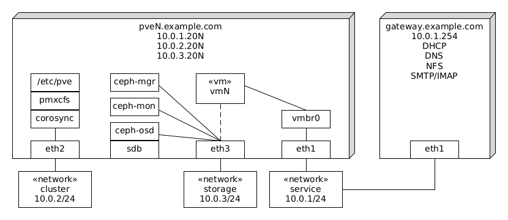

This is a 3-node proxmox-ve cluster wrapped in a vagrant environment.

Each node has the following components and is connected to the following networks:



The second node (`pve2.example.com`) is running:

* One Alpine Linux container provisioned by [provision-alpine-template-container.sh](provision-alpine-template-container.sh) and booted from the alpine template.
  * You can login with the `root` username and `vagrant` password.
* One Debian Live virtual machine provisioned by [provision-debian-live-virtual-machine.sh](provision-debian-live-virtual-machine.sh) and booted from the [rgl/debian-live-builder-vagrant](https://github.com/rgl/debian-live-builder-vagrant) iso.
  * You can login with the `vagrant` username and no password.
  * **NB** This does not work in VirtualBox because it has no support for nested virtualization.

# Usage

Build and install the [proxmox-ve Base Box](https://github.com/rgl/proxmox-ve).

Add the following entries to your `/etc/hosts` file:

```
10.1.0.254 example.com
10.1.0.201 pve1.example.com
10.1.0.202 pve2.example.com
10.1.0.203 pve3.example.com
```

Install the following Vagrant plugins:

```bash
vagrant plugin install vagrant-reload   # see https://github.com/aidanns/vagrant-reload
vagrant plugin install vagrant-triggers # see https://github.com/emyl/vagrant-triggers
```

Run `vagrant up --provider=libvirt` (or `--provider=virtualbox`) to launch the 3-node cluster.

Trust the Example CA. If your host is Ubuntu based, run, in a bash shell:

```bash
# for OpenSSL based applications (e.g. wget, curl, http):
sudo cp shared/example-ca/example-ca-crt.pem /usr/local/share/ca-certificates/example-ca.crt
sudo update-ca-certificates -v
# for NSS based applications (e.g. chromium, chrome):
# see https://developer.mozilla.org/en-US/docs/Mozilla/Projects/NSS/Tools
sudo apt install -y libnss3-tools
certutil -d sql:$HOME/.pki/nssdb -A -t 'C,,' -n example-ca -i shared/example-ca/example-ca-crt.pem
certutil -d sql:$HOME/.pki/nssdb -L
#certutil -d sql:$HOME/.pki/nssdb -D -n example-ca # delete.
# for legacy NSS based applications (e.g. firefox, thunderbird):
for d in $HOME/.mozilla/firefox/*.default $HOME/.thunderbird/*.default; do
  certutil -d dbm:$d -A -t 'C,,' -n example-ca -i shared/example-ca/example-ca-crt.pem
  certutil -d dbm:$d -L
  #certutil -d sql:$d -D -n example-ca # delete.
done
```

If your host is Windows based, run, in a Administrator PowerShell shell:

```powershell
Import-Certificate `
    -FilePath shared/example-ca/example-ca-crt.der `
    -CertStoreLocation Cert:/LocalMachine/Root
```

Access the Proxmox Web Administration endpoint at either one of the nodes, e.g., at [https://pve1.example.com:8006](https://pve1.example.com:8006).

Login as `root` and use the `vagrant` password.

# Reference

 * [Proxmox VE Cluster Manager](https://pve.proxmox.com/wiki/Cluster_Manager)
 * [Proxmox VE Ceph Server](https://pve.proxmox.com/wiki/Ceph_Server)
 * [Proxmox VE RADOS Block Device (RBD) Storage Pool Type](https://pve.proxmox.com/wiki/Storage:_RBD)
 * [Ceph Intro and Architectural Overview by Ross Turk](https://www.youtube.com/watch?v=OyH1C0C4HzM)
